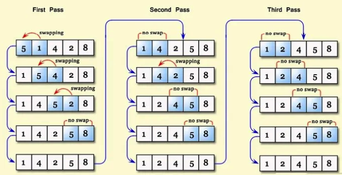
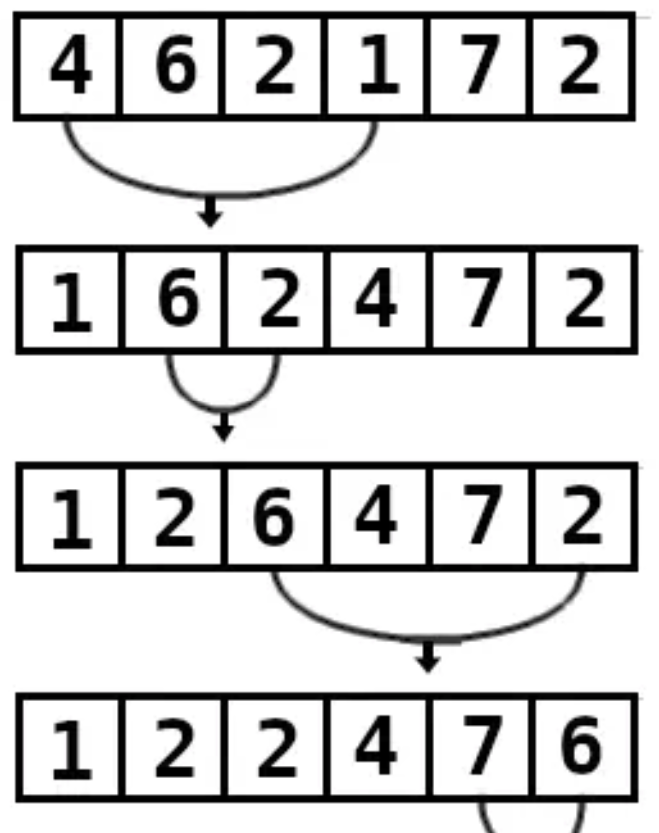
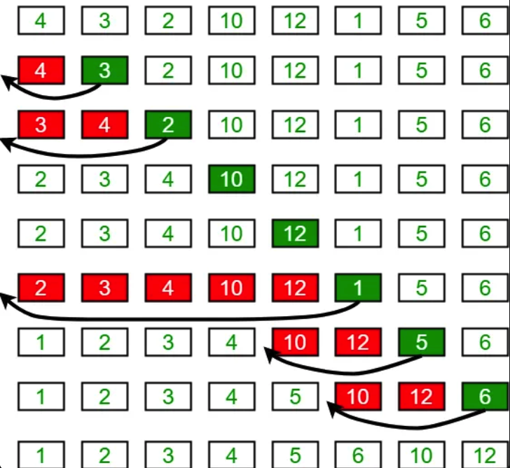

# Algoritmos de Ordenação Simples

Este repositório contém implementações básicas de algoritmos de ordenação em C++: **Bubble Sort**, **Selection Sort** e **Insertion Sort**. Estes algoritmos são úteis para entender os fundamentos de ordenação e como manipular arrays.

---

## **Como Compilar e Executar**

### **Compilação**

Para compilar o arquivo C++ com o `g++`, utilize:

```bash
g++ <filename>.cpp -o <filename_out>
```

Exemplo:

```bash
g++ main.cpp -o main && ./main
```

# Bubble Sort



- Compara elementos adjacentes e troca-os se estiverem fora de ordem.
- Após cada varredura completa, o maior elemento estará na sua posição final (mais à direita).
- O(n) quando o array já está ordenado
- O(nˆ2) → Quando o array está em ordem inversa

# Selection Sort



- Encontra o menor elemento e o move para a posição inicial.
- Repete o processo deslocando o início da pesquisa para a direita.
- O(nˆ2) em todos os casos

# Insertion Sort



- Divide o array em duas partes: ordenada e não ordenada.
- Insere elementos da parte não ordenada na posição correta da parte ordenada.
- O(n) para arrays quase ordenados
- O(nˆ2) para arrays inversamente ordenados
